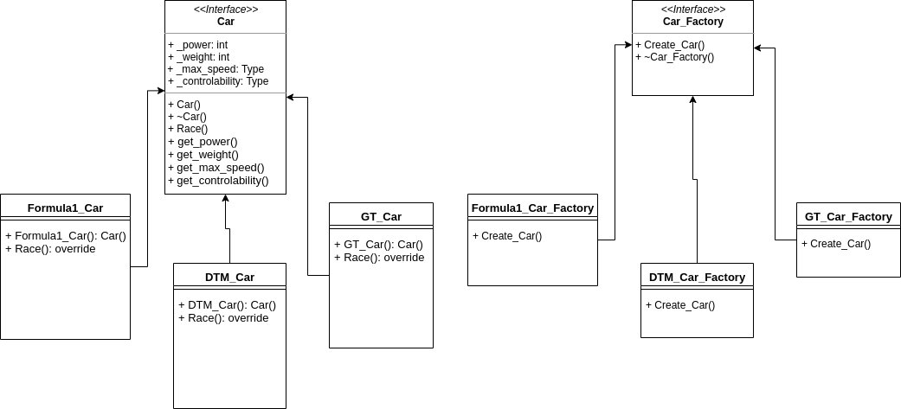

#  Racing

### 10.04.2020 

На данный момент реализованы создание юнитов игры с помощью порождающего паттерна - Фабрика и юнит-тестирование.  

##### Сборка и запуск:
- сборка cmake ..
- запуск make all
- в Racin/bin будут лежать исполняемые Racing и Racing_tst

##### Подробнее об архитектуре:

Создан абстрактный класс Car от которого наследуются классы (гоночные автомобили различных автоспортивных серий)
Для модификации поведения класса автомобиль используется паттерн - Декоратор
Выбор типа гонки реализован с помощью поведенческого паттерна - Стратегия

##### Диаграма классов:

